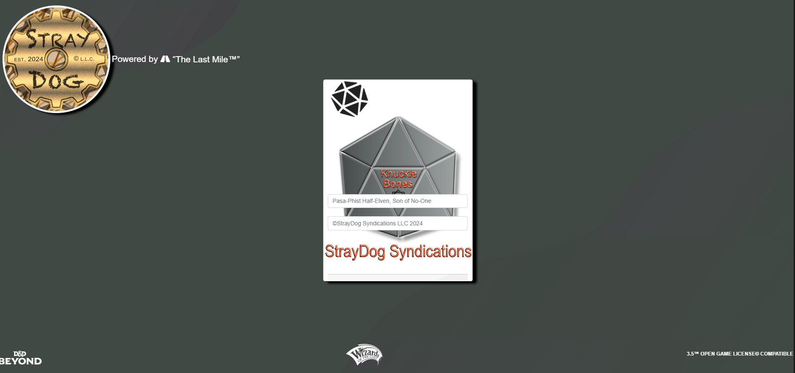
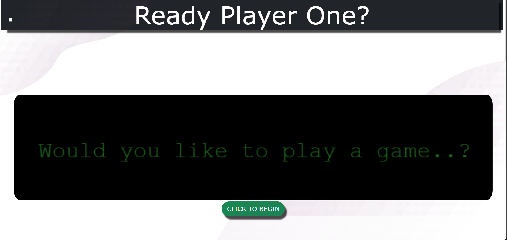

# WDF-GitLab-TheLastMileProgram


<p align="center">
  
</p>

<p align="center">
  <strong>Full-Stack Web Development Portfolio</strong><br>
  <i>Completed as part of The Last Mile Program</i>
</p>

<p align="center">
  <a href="https://straydogsyn.github.io/WDF-GitLab-TheLastMileProgram/">🌐 Live Portfolio</a> •
  <a href="#projects">📂 Projects</a> •
  <a href="#technologies">💻 Technologies</a> •
  <a href="#contact">📧 Contact</a>
</p>

---

## Overview

This repository showcases a comprehensive portfolio of web development projects demonstrating proficiency in modern JavaScript, responsive design, interactive UI/UX, and full-stack development principles. Each project is production-ready, fully documented, and deployed to GitHub Pages.

**Key Highlights:**

- ✨ 4 complete web applications
- 📱 Mobile-first responsive design
- 🎨 Premium glassmorphic UI with micro-interactions
- ♿ Accessibility-focused implementation
- 🚀 Deployed and live on GitHub Pages

---

## Table of Contents

- [Projects](#projects)
  - [1. Super Quiz Master (Featured)](#1-super-quiz-master-featured)
  - [2. Knuckle Bones RPG (Capstone)](#2-knuckle-bones-rpg-capstone)
  - [3. Rock Paper Scissors](#3-rock-paper-scissors)
  - [4. Rock Paper Scissors Lizard Spock](#4-rock-paper-scissors-lizard-spock)
- [Technologies Used](#technologies-used)
- [Installation & Usage](#installation--usage)
- [Project Structure](#project-structure)
- [License](#license)
- [Contact](#contact)

---

## Projects

### 1. Super Quiz Master (Featured)

> **CompTIA A+ & Security+ Certification Practice Platform**

<p align="center">
  
</p>

**Description:**  
Interactive certification exam preparation with dynamic question banks, real-time feedback, and progress tracking. Features over 100+ practice questions for CompTIA A+ and Security+ certifications.

**Key Features:**

- 📚 Dynamic quiz engine with randomized questions
- ⚡ Real-time scoring and instant feedback
- 📊 Progress tracking and performance analytics
- 🎯 User-generated question support
- 💾 Local storage for score persistence
- 🎨 Professional UI with smooth animations

**Technologies:**  
JavaScript, jQuery, Bootstrap 5, Font Awesome, HTML5, CSS3

**Links:**

- 🌐 [Live Demo](https://straydogsyn.github.io/WDF-GitLab-TheLastMileProgram/super-quiz-master/compTIA/index.html)
- 📖 [Project README](./super-quiz-master/compTIA/README.md)
- 💻 [Source Code](./super-quiz-master/compTIA/)

**Variants:**

- 📝 [Test Quiz Version](./super-quiz-master/testQuiz/) - [README](./super-quiz-master/testQuiz/README.md)

---

### 2. Knuckle Bones RPG (Capstone)

> **Tabletop RPG Character & Campaign Management System**

<p align="center">
  
</p>

**Description:**  
A comprehensive mobile-first web application for managing D&D and Pathfinder characters, inventory, dice rolling, and campaign tracking. Features a custom dice emulator and character sheet manager.

**Key Features:**

- 🎲 Advanced dice roller (d4, d6, d8, d10, d12, d20, d100)
- 👤 Character sheet creation and management
- 🎒 Inventory and equipment tracking
- 📝 Downtime and journal system
- 🗺️ Campaign notes and session logs
- 📱 Mobile-optimized responsive design
- 🎨 Semantic UI integration with custom theming

**Technologies:**  
JavaScript, jQuery, Bootstrap 5, Semantic UI, Font Awesome, HTML5, CSS3

**Links:**

- 🌐 [Live Demo](https://straydogsyn.github.io/WDF-GitLab-TheLastMileProgram/capstone-project-master/capstone-project-master/index.html)
- 📖 [Project README](./capstone-project-master/capstone-project-master/README.md)
- 💻 [Source Code](./capstone-project-master/capstone-project-master/)

**Prototypes:**

- 🧪 [Character Prototype](./capstone-project-master/capstone-project-master/prototypes/character/) - [README](./capstone-project-master/capstone-project-master/prototypes/character/README.md)
- 🧪 [Pathfinder Variant](./capstone-project-master/capstone-project-master/prototypes/pathfinder/)
- 🧪 [Pasa-Phist Demo](./capstone-project-master/capstone-project-master/prototypes/pasa-phist/)

---

### 3. Rock Paper Scissors

> **Classic Game with Modern Interactive UI**

<p align="center">
  
</p>

**Description:**  
A modern take on the classic Rock, Paper, Scissors game featuring smooth animations, keyboard shortcuts, and an AI opponent with multiple difficulty levels.

**Key Features:**

- 🎮 Play against computer AI
- ⌨️ Keyboard shortcuts for quick gameplay
- 🏆 Score tracking and leaderboard
- 🔄 Replay functionality
- 🎨 Animated hand gestures and transitions
- 📱 Responsive mobile design

**Technologies:**  
Vanilla JavaScript, HTML5, CSS3, Bootstrap 5, Font Awesome

**Links:**

- 🌐 [Live Demo](https://straydogsyn.github.io/WDF-GitLab-TheLastMileProgram/rock-paper-scissors-master/index.html)
- 📖 [Project README](./rock-paper-scissors-master/README.md)
- 💻 [Source Code](./rock-paper-scissors-master/)

**Variants:**

- 🎨 [Eric Petross Edition](./rock-paper-scissors-master/eric-petross-rock-paper-scissors/) - [README](./rock-paper-scissors-master/eric-petross-rock-paper-scissors/README.md)

---

### 4. Rock Paper Scissors Lizard Spock

> **Advanced 5-Choice Variant (Big Bang Theory Edition)**

<p align="center">
  
</p>

**Description:**  
The advanced variant of Rock, Paper, Scissors featuring Lizard and Spock. This version includes all 5 game choices with complex win conditions, modern UI design, and smooth animations.

**Key Features:**

- 🖖 5 game choices (Rock, Paper, Scissors, Lizard, Spock)
- 🎯 Complex rule set with 10 win conditions
- 🎨 Modern Bootstrap 5 design
- 🎭 Smooth CSS3 animations
- 📊 Score persistence
- 🎮 Interactive gameplay with visual feedback

**Game Rules:**

- Scissors cuts Paper & decapitates Lizard
- Paper covers Rock & disproves Spock
- Rock crushes Lizard & crushes Scissors
- Lizard poisons Spock & eats Paper
- Spock smashes Scissors & vaporizes Rock

**Technologies:**  
JavaScript, jQuery, Bootstrap 5, CSS3, Font Awesome

**Links:**

- 🌐 [Live Demo](https://straydogsyn.github.io/WDF-GitLab-TheLastMileProgram/rock-paper-scissors-master/reboot/index.html)
- 📖 [Project README](./rock-paper-scissors-master/reboot/README.md)
- 💻 [Source Code](./rock-paper-scissors-master/reboot/)

---

## Technologies Used

### Frontend Frameworks & Libraries

- **JavaScript** (ES6+) - Core application logic
- **jQuery** (3.5.1) - DOM manipulation and AJAX
- **Bootstrap 5** (5.2.3) - Responsive grid and components
- **Semantic UI** (2.4.1) - Advanced UI components
- **Tailwind CSS** (CDN) - Utility-first styling for portfolio page

### UI/UX Enhancements

- **Font Awesome** (5.15.2) - Icon library
- **Lucide Icons** - Modern icon set
- **Custom CSS3** - Animations and transitions
- **Glassmorphic Design** - Modern UI aesthetic

### Development Tools

- **HTML5** - Semantic markup
- **CSS3** - Advanced styling and animations
- **Git/GitHub** - Version control and deployment
- **GitHub Pages** - Live hosting
- **VS Code** - Primary development environment

### Features Implemented

- ✨ Responsive mobile-first design
- 🎨 Premium micro-interactions and animations
- ♿ Accessibility-focused markup
- 💾 Local storage for data persistence
- 🔄 AJAX for dynamic content loading
- 🎯 Event-driven architecture
- 📱 Touch-friendly interfaces

---

## Installation & Usage

### Live Deployment

Visit the live portfolio: **[https://straydogsyn.github.io/WDF-GitLab-TheLastMileProgram/](https://straydogsyn.github.io/WDF-GitLab-TheLastMileProgram/)**

### Local Development

1. **Clone the repository:**

   ```bash
   git clone https://github.com/StrayDogSyn/WDF-GitLab-TheLastMileProgram.git
   cd WDF-GitLab-TheLastMileProgram
   ```

2. **Open any project:**

   ```bash
   # For Super Quiz Master
   open super-quiz-master/compTIA/index.html

   # For Knuckle Bones RPG
   open capstone-project-master/capstone-project-master/index.html

   # For Rock Paper Scissors
   open rock-paper-scissors-master/index.html

   # For RPS Lizard Spock
   open rock-paper-scissors-master/reboot/index.html

   # For Portfolio Landing Page
   open index.html
   ```

3. **No build process required** - All projects use CDN resources and are ready to run!

---

## Project Structure

```plaintext
WDF-GitLab-TheLastMileProgram/
│
├── index.html                          # Portfolio landing page
├── README.md                           # This file
├── LICENSE                             # Unlicense
│
├── super-quiz-master/                  # Quiz application project
│   ├── compTIA/                        # Main CompTIA version
│   │   ├── index.html
│   │   ├── README.md
│   │   ├── assets/
│   │   ├── css/
│   │   └── js/
│   └── testQuiz/                       # Test variant
│       ├── index.html
│       ├── README.md
│       └── assets/
│
├── capstone-project-master/            # RPG character manager
│   └── capstone-project-master/
│       ├── index.html
│       ├── README.md
│       ├── assets/
│       ├── css/
│       ├── js/
│       └── prototypes/                 # Early prototypes
│           ├── character/
│           ├── pathfinder/
│           └── pasa-phist/
│
└── rock-paper-scissors-master/         # Game projects
    ├── index.html                      # Classic version
    ├── README.md
    ├── assets/
    ├── css/
    ├── js/
    ├── eric-petross-rock-paper-scissors/  # Variant
    │   ├── index.html
    │   └── README.md
    └── reboot/                         # Lizard Spock edition
        ├── index.html
        ├── README.md
        └── assets/
```

---

## License

This repository is licensed under **[The Unlicense](LICENSE)** - Public Domain equivalent.

You are free to:

- ✅ Use commercially
- ✅ Modify and distribute
- ✅ Use privately
- ✅ No attribution required

See the [LICENSE](LICENSE) file for full details.

---

## Contact

**Eric H. Petross (StrayDogSyn)**  
*Full-Stack Developer | The Last Mile Program Graduate*

- 🌐 **Portfolio:** [https://straydogsyn.github.io/WDF-GitLab-TheLastMileProgram/](https://straydogsyn.github.io/WDF-GitLab-TheLastMileProgram/)
- 💼 **Company:** [StrayDog Syndications LLC](https://straydog-syndications-llc.com)
- 💻 **Tech Portal:** [straydogsyndicationllc.tech](https://straydogsyndicationllc.tech)
- 📧 **Email:** eHunter@straydog-secondstory.org
- 🐙 **GitHub:** [@StrayDogSyn](https://github.com/StrayDogSyn)

---

## Acknowledgments

- **The Last Mile Program** - Web Development Fundamentals Course
- **Frontend Mentor** - Rock Paper Scissors design inspiration
- **Paizo Publishing** - Pathfinder & D&D inspiration for RPG project
- **CompTIA** - Certification practice content

---

<p align="center">
  <i>Developed with passion for justice reform and technical excellence</i><br>
  <strong>StrayDog Syndications LLC © 2024-2025</strong>
</p>

<p align="center">
  
  <br>
  <small>Proud Participant of The Last Mile™ Program</small>
</p>
